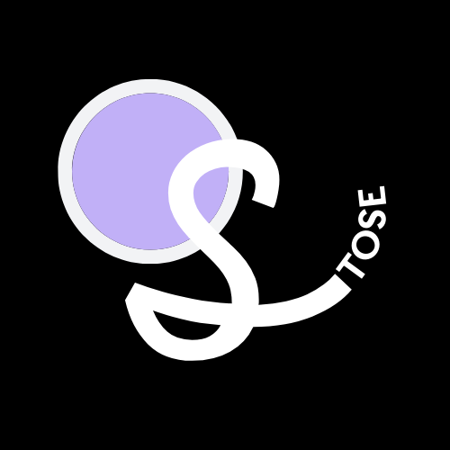

<!-- PROJECT SHIELDS -->
[![Contributors][contributors-shield]][contributors-url]

<!-- PROJECT LOGO -->
 

  

  <h2 align="center">Stose</h2>

  

    Proyecto académico de un sitio web de comercio electrónico.
     
    <a href="https://github.com/AnderMendoza/Stose"><strong>Explora los documentos »</strong></a>
     
     
    <a href="https://github.com/AnderMendoza/Stose">Ver demostración</a>
    ·
    <a href="https://github.com/AnderMendoza/Stose/issues/new?assignees=&labels=feature&template=bug_report_es.md&title=">Reportar un error</a>
    ·
    <a href="https://github.com/AnderMendoza/Stose/issues/new?assignees=&labels=feature&template=feature_request_es.md&title=">Solicitar fusión</a>
  

  

    <a href="/README.md">English</a>
    ·
    <a href="/READMEes.md">Español</a>
  

<!-- TABLE OF CONTENTS -->

  
Tabla de Contenido

  <ol>
    <li>
      <a href="#sobre-el-proyecto">Sobre el proyecto</a>
    </li>
    <li><a href="#prototipo">Prototipo</a></li>
    <li><a href="#arquitectura">Arquitectura</a></li>
    <li><a href="#contribución">Contribución</a></li>
    <li><a href="#contacto">Contacto</a></li>
    <li><a href="#reconocimiento">Reconocimiento</a></li>
  </ol>

<!-- ABOUT THE PROJECT -->
## Sobre el proyecto

Este es un proyecto académico enfocado en el desarrollo de una aplicación web de comercio electrónico, la idea de la aplicación es desarrollar una tienda de libros virtual donde el usuario pueda interactuar y comprar algunos libros físicos populares del momento.

(<a href="#top">volver al inicio</a>)

<!-- MOCKUPS -->
## Prototipo

![Mockups Screen Shot][mockups-screenshot]

Este es un prototipo de nuestra aplicación web. El diseño puede cambiar a medida que se desarrolla el proyecto. Recuerda que estamos abiertos a sugerencias e ideas para el proyecto, consulta los [temas abiertos](https://github.com/AnderMendoza/Stose/issues) y déjanos tus comentarios.

(<a href="#top">volver al inicio</a>)

<!-- ROADMAP -->
## Arquitectura

![Architech Name Screen Shot][architech-screenshot]

#### Cosas para hacer:

- [ ] Inicio de sesión funcional
    - [ ] Autenticacion de usuario
    - [ ] Registro de usuario
    - [ ] Inicia sesión con Google
    - [ ] Cerrar sesión
- [ ] Perfil adaptado a cada usuario
- [ ] Caja de comentarios
- [ ] Redes sociales
- [ ] Filtro de búsqueda
- [ ] Modo oscuro
- [ ] Responsive

Consulta los [temas abiertos](https://github.com/AnderMendoza/Stose/issues) para seguir el desarrollo de cada una de las actividades pendientes.

(<a href="#top">volver al inicio</a>)

<!-- CONTRIBUTING -->
## Contribución

Las contribuciones son lo que hace que la comunidad de código abierto sea un lugar increíble para aprender, inspirar y crear. Cualquier contribución que hagas es **muy apreciada**.

Si tiene una sugerencia que mejoraría esto, bifurque el repositorio y cree una solicitud de extracción. También puede simplemente abrir un problema con la etiqueta "improvement". ¡No olvides darle una estrella al proyecto! ¡Gracias de nuevo!

1. Bifurcar el proyecto
2. Cree su rama de funciones (`git checkout -b feature/improvementStose`)
3. Confirme sus cambios (`git commit -m 'Agregando mis características a su proyecto'`)
4. Empuje a la misma rama (`git push origin feature/Stose enhancement`)
5. Abra una solicitud de extracción

(<a href="#top">volver al inicio</a>)

<!-- CONTACT -->
## Contacto

Anderson Mendoza - [@Anderson](https://www.linkedin.com/in/anderson-mendoza-ramos-7551141b7/) - davidmramos53@gmail.com

(<a href="#top">volver al inicio</a>)

<!-- ACKNOWLEDGMENTS -->
## Reconocimiento

Nos gustaría agregar una lista de recursos que encontramos útiles para el desarrollo de este proyecto al que damos crédito.

* [Canva](https://www.canva.com/)
* [Balsamiq](https://balsamiq.cloud/)

(<a href="#top">volver al inicio</a>)

<!-- MARKDOWN LINKS & IMAGES -->
<!-- https://www.markdownguide.org/basic-syntax/#reference-style-links -->
[contributors-shield]: https://img.shields.io/badge/CONTRIBUIDORES-5-green?style=for-the-badge
[contributors-url]: https://github.com/AnderMendoza/Stose/graphs/contributors
[architech-screenshot]: assets/images_readme/architech/threeLevelArchitectureEs.png
[mockups-screenshot]: assets/images_readme/mockups/allMockups.png
